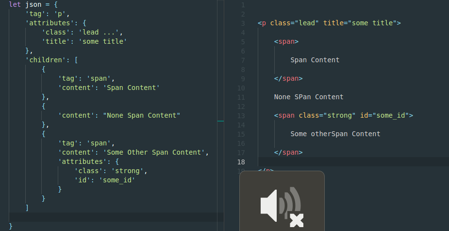

<!--
*** Thanks for checking out this README Template. If you have a suggestion that would
*** make this better please fork the repo and create a pull request or simple open
*** an issue with the tag "enhancement".
*** Thanks again! Now go create something AMAZING! :D
-->


<!-- PROJECT LOGO -->
<br />
<p align="center"><h3 align="center">JSON to HTML Parser</h3>

  <p align="center">
    A Simple way to convert JSON representation of HTML to real HTML
    <br />
    ·
    <a href="https://github.com/mthdht/json-to-html/issues">Report Bug</a>
    ·
    <a href="https://github.com/mthdht/json-to-html/issues">Request Feature</a>
  </p>
</p>


<!-- TABLE OF CONTENTS -->
## Table of Contents

- [Table of Contents](#Table-of-Contents)
- [About The Project](#About-The-Project)
- [Getting Started](#Getting-Started)
  - [Prerequisites](#Prerequisites)
  - [Installation](#Installation)
- [Usage](#Usage)
  - [Examples](#Examples)
- [Contributing](#Contributing)
- [License](#License)
- [Contact](#Contact)

## About The Project



This package is a simple class that allows you to convert Html elements as Json format into a html string

A element is represented by 4 attributes: `tag` - `attributes` - `content` - `children` (see [Usage](#Usage))

<!-- GETTING STARTED -->
## Getting Started


### Prerequisites

* npm
```sh
npm install npm@latest -g
```

### Installation

1. Install NPM packages
```sh
npm install @mthdht/json-to-html-parser
```


<!-- USAGE EXAMPLES -->
## Usage

First you have to import the newly installed package, then use it in your code
``` javascript
import JsonConverter from '@mthdht/json-to-html-parser' // as ES6 module or, 
let JsonConverter = require('@mthdht/json-to-html-parser') // as node js module

// Your code ...
let result = JsonConverter.convertToElement(SomeJsonRepresentationOfElements)

```

The Json data that you pass into the `convertToElement` method must some rules:

1. It must have a root element
2. There are 4 main attributes to represent a html element (see [Examples](#examples)):
   1. `tag`: The name of the element (required except if **only** have `content` attribute)
   2. `attributes`: An object of the element attributes. eg: { 'class': 'some class', ...} (optional)
   3. `content`: The texte content of the element (optional but cannot be used with `children` attribute)
   4. `children`: An array of children elements (optional)

### Examples

For a simple element

``` javascript
{
    'tag': 'p',
    'attributes': {
        'class': 'classe1 classe2 ...',
        'title': 'Some title',
        ...
    },
    'content': 'My p content'
}
```

Using `JsonConverter.convertToElement` on this json representation will return a string that looks like this:

``` html
<p class="classe1 classe2 ..." title="Some title" ...>My p content</p>
```

You can build nested elements by using the `children` attribute. It must be an array with all nested elements you want

``` javascript
{
    'tag': 'div',
    'attributes': {...},
    'children': [
        {
            'tag': 'element1'
            ...
        },
        {
            'tag': 'element2,
            ...
        }
    ]
}
```

Will return some string like this:

``` html
<div atribute1="value1" ...>
    <element1 ...>...</element1>
    <element2 ...>...</element2>
</div>
```

Sometimes you may wish having an element with text content surrounded by other elements like `span`, `strong` etc...

In this case, you can use an object with only the `content` attribute in the `children` attribute like this:

``` javascript
{
    'tag': 'element',
    'attributes': {...}, // if needed
    'children': [
        {
            'content': 'The text content'
        },
        {
            'tag': 'span,
            'content': 'Some Span Content'
        }
    ]
}
```

will return this: 
``` html
<element ...>
    The text content<span>SomeSpan Content</span>
</element>
```


<!-- CONTRIBUTING -->
## Contributing

Contributions are what make the open source community such an amazing place to be learn, inspire, and create. Any contributions you make are **greatly appreciated**.

1. Fork the Project
2. Create your Feature Branch (`git checkout -b feature/AmazingFeature`)
3. Commit your Changes (`git commit -m 'Add some AmazingFeature`)
4. Push to the Branch (`git push origin feature/AmazingFeature`)
5. Open a Pull Request


<!-- LICENSE -->
## License

Distributed under the MIT License. 

<!-- CONTACT -->
## Contact

Mthdht - [@mthdht](https://twitter.com/mthdht) - mthdht@gmail.com

Project Link: [https://github.com/mthdht/json-to-html-parser](https://github.com/mthdht/json-to-html-parser)
